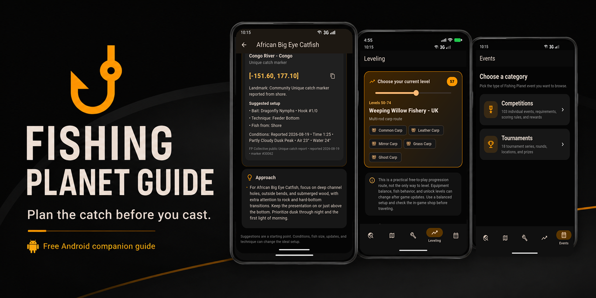
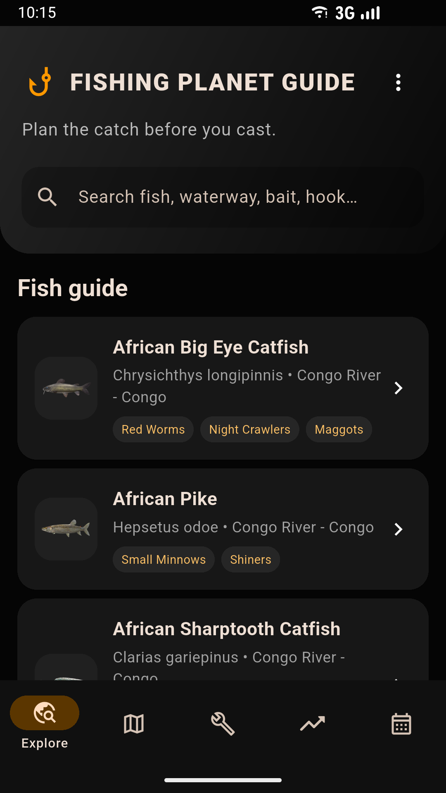
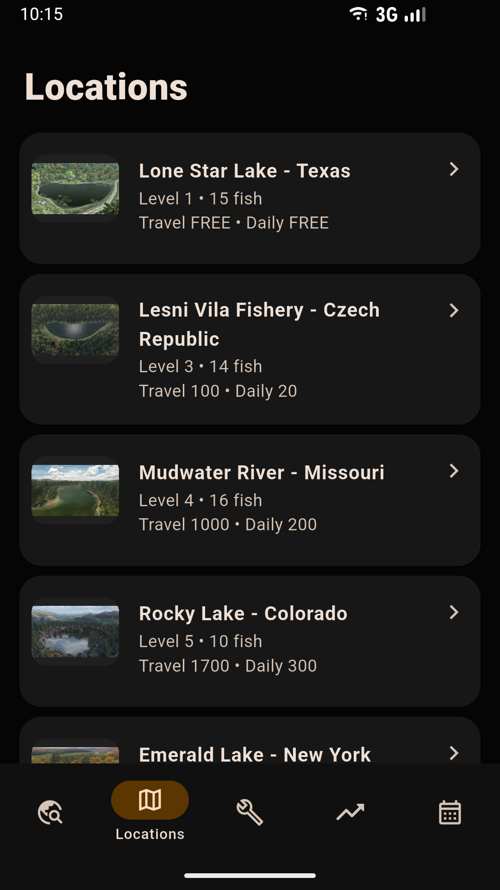
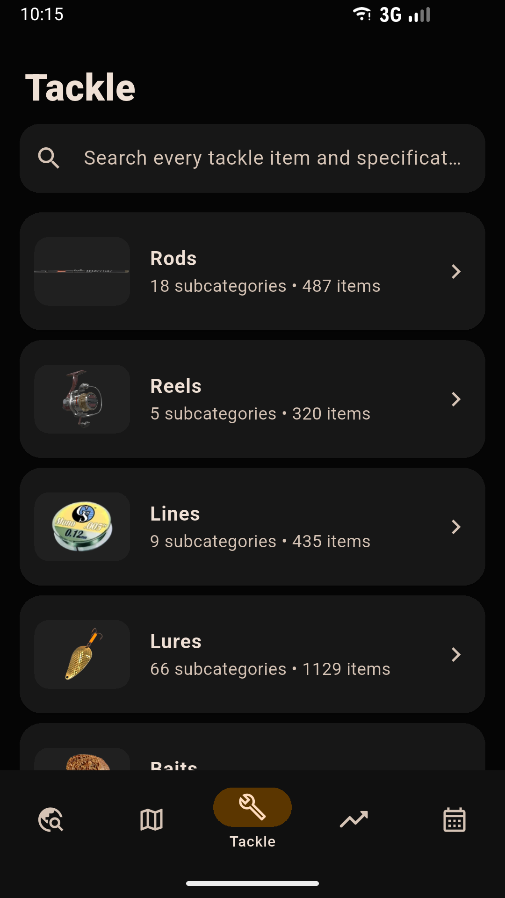
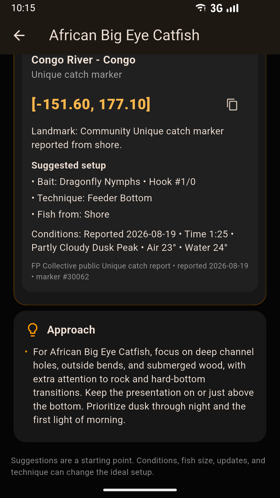
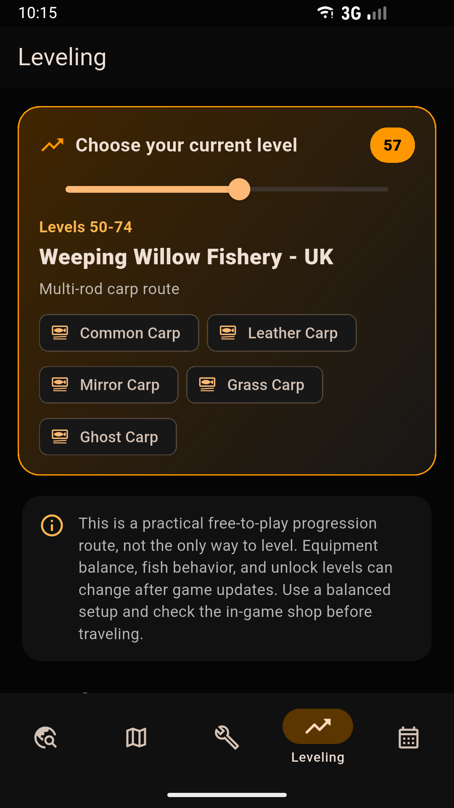
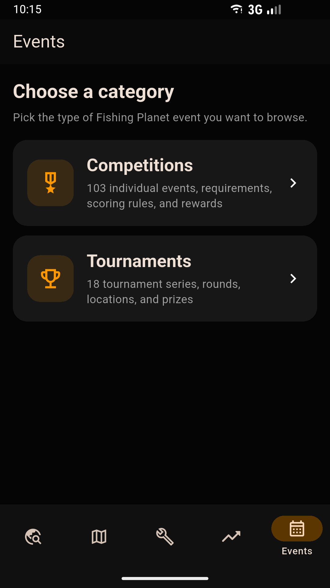
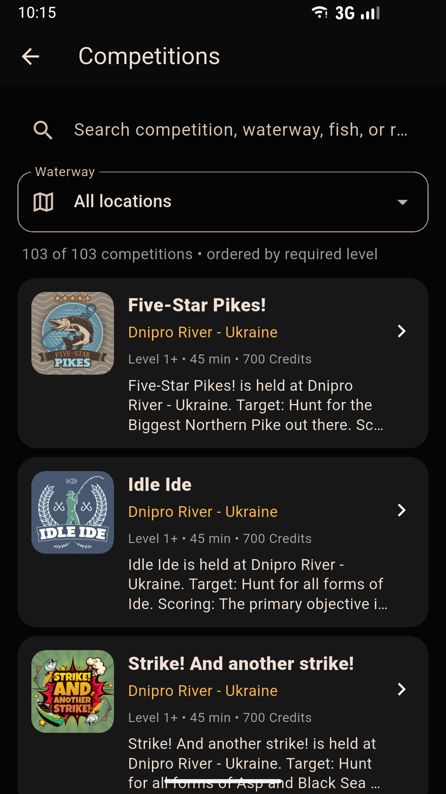
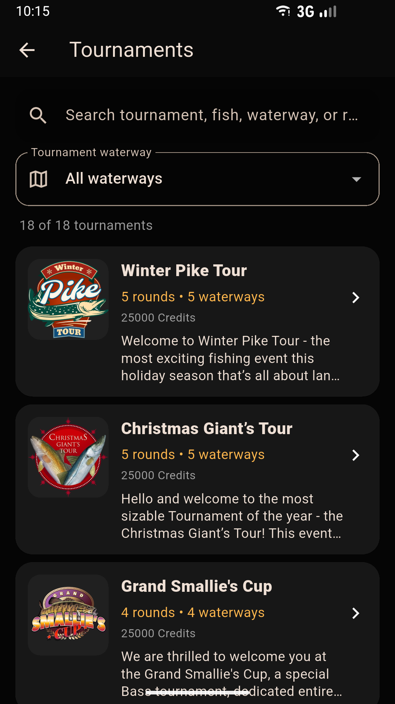

# Fishing Planet Guide

An unofficial Android companion guide for Fishing Planet players, created by Smeltser Technologies.

**[Visit the app website](https://joesmeltser.github.io/fishing-planet-guide/)** · [Download the latest Android APK](https://github.com/joesmeltser/fishing-planet-guide/releases/latest)

## Watch the app tour

**[Play the Fishing Planet Guide promotional video](https://joesmeltser.github.io/fishing-planet-guide/#video)**

## App previews

  
  
  

  
  
  

  
  

## What is included

- Fish, locations, preferred baits, hook sizes, rigs, and hotspot guidance
- Level-ordered waterways with travel costs and fish lists
- Interactive level 1-105 progression routes with target fish and recommended setups
- Detailed rods, reels, lines, lures, hooks, rigs, equipment, and other tackle
- Fishing Planet competition and tournament reference sections
- A dark Fishing Planet-inspired design with orange accents

## Installation

1. Open the [latest release](https://github.com/joesmeltser/fishing-planet-guide/releases/latest).
2. Download the APK under **Assets**.
3. Open the APK on your Android phone.
4. If Android asks, allow installation from your browser or file manager.

The current APK is built for ARM64 Android phones.

## Copyright and legal status

Copyright © 2026 Smeltser Technologies. All rights reserved. Copyright is
claimed only in original material created for this guide, including original
code, writing, organization, interface elements, and original artwork.

Fishing Planet and related trademarks are the property of Fishing Planet LLC.
Fishing Planet Guide is an unofficial community companion and is not
affiliated with, sponsored by, endorsed by, or approved by Fishing Planet LLC.
See the [legal notice](https://joesmeltser.github.io/fishing-planet-guide/legal.html)
for details.
