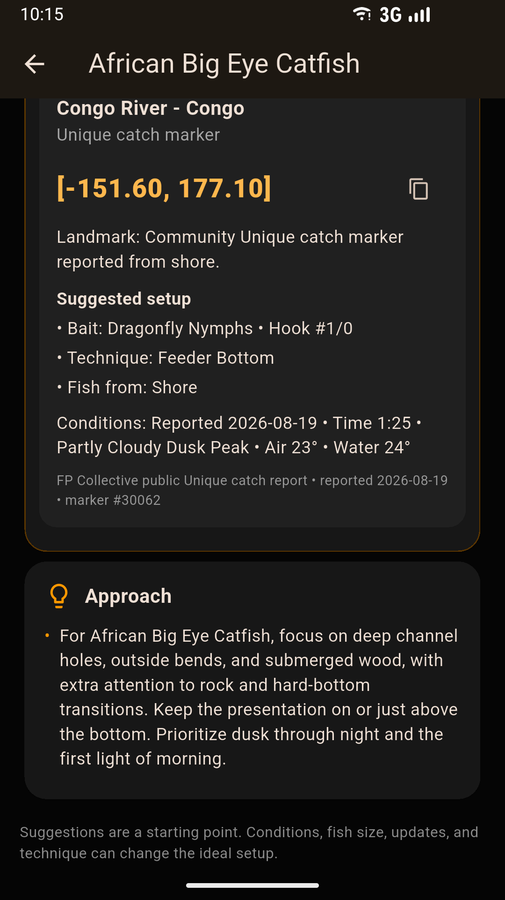
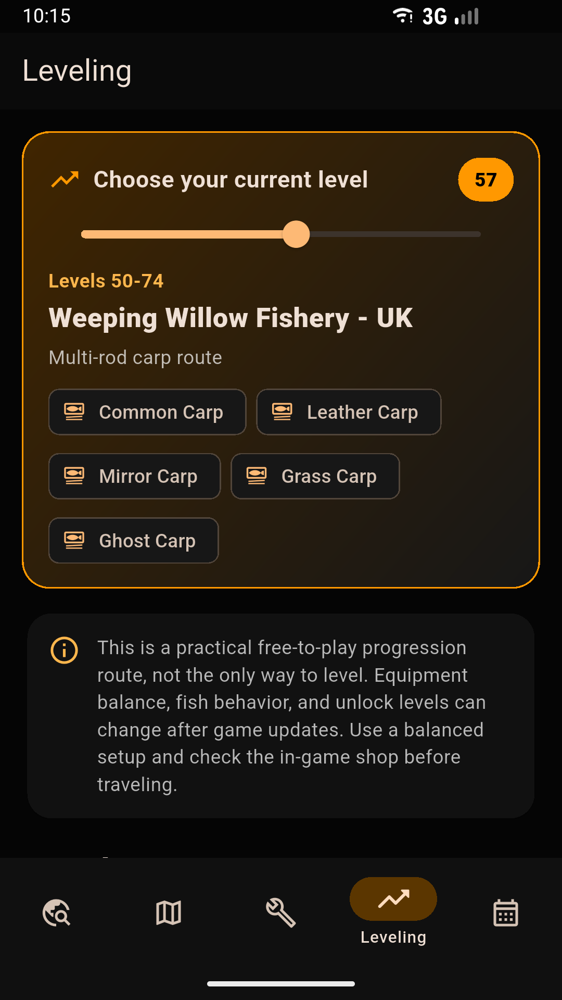
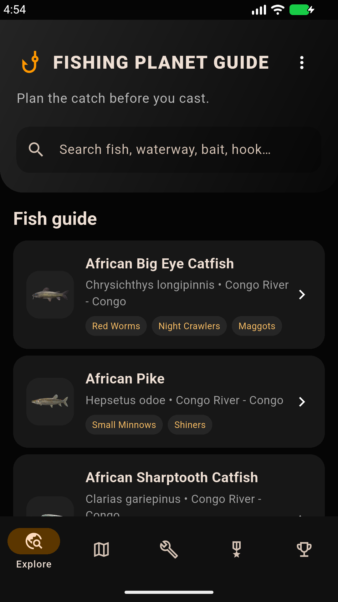
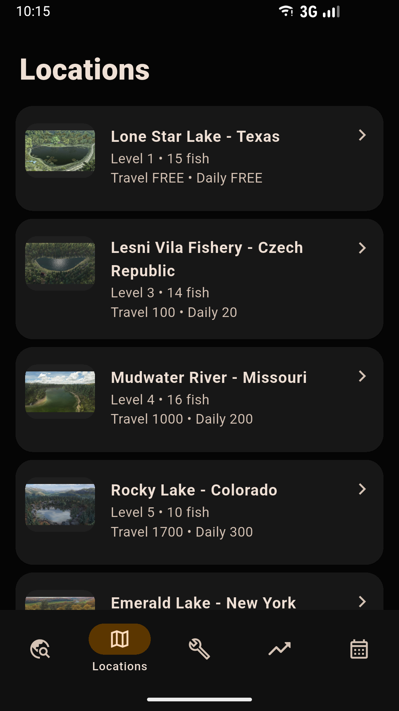
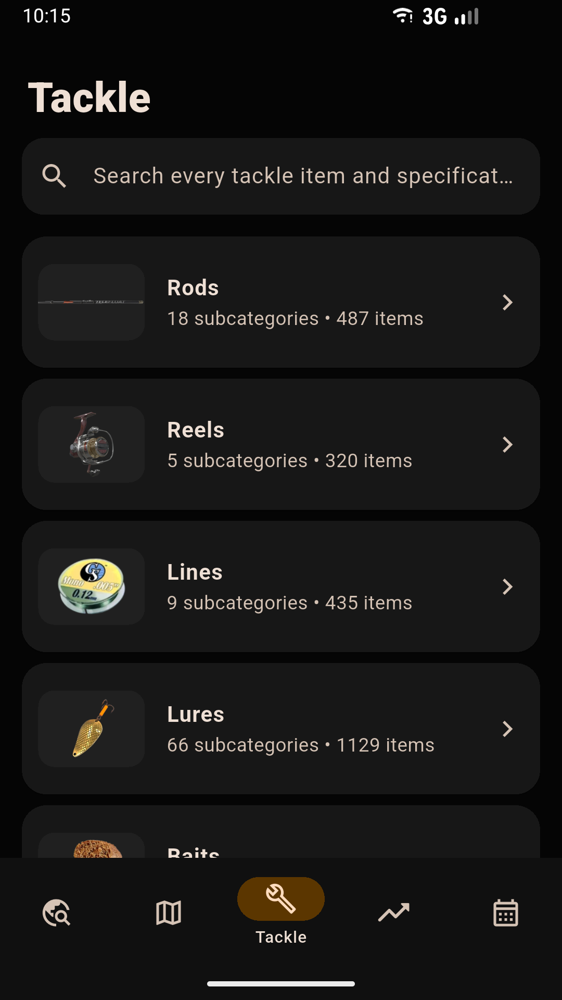
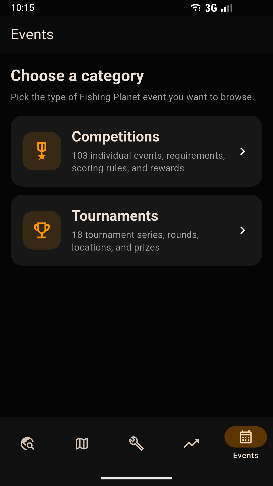
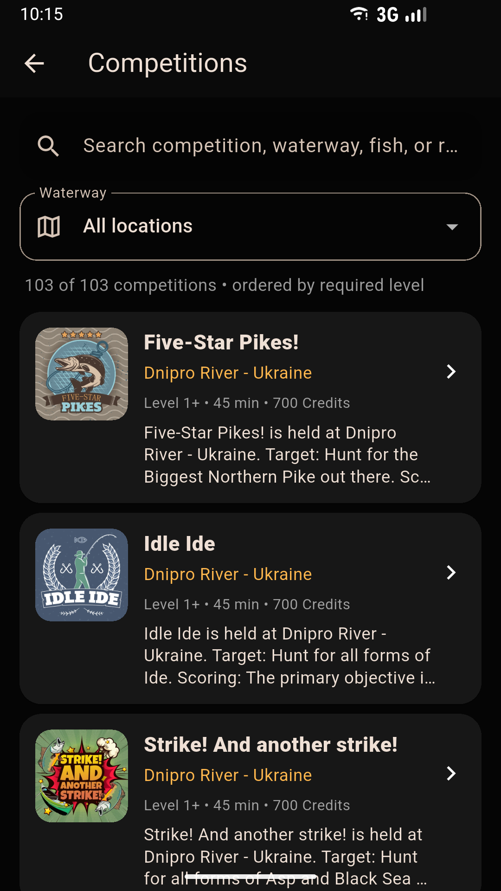
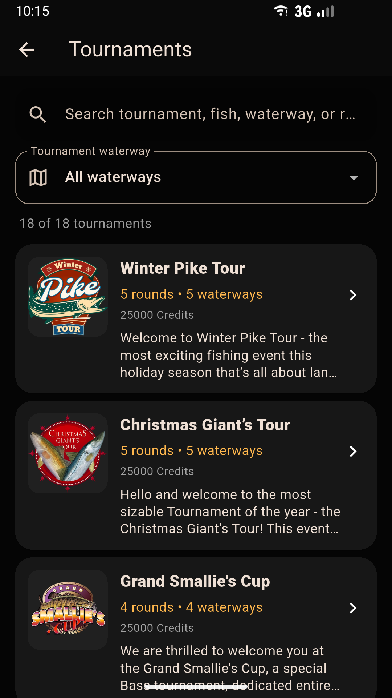

# Fishing Planet Guide

An unofficial Android companion centered on fish hotspot coordinates, complete suggested setups, and interactive level 1-105 routes, created by Smeltser Technologies.

**[Visit the app website](https://joesmeltser.github.io/fishing-planet-guide/)** · **[Get Fishing Planet Guide on Google Play](https://play.google.com/store/apps/details?id=com.smeltsertechnologies.fishingplanetguide)**

## Watch the app tour

**[Play the Fishing Planet Guide promotional video](https://joesmeltser.github.io/fishing-planet-guide/#video)**

## App previews

  
  
  

  
  
  

  
  

## What is included

- Hotspot coordinates with target class, setup, conditions, and fish-specific approach
- Interactive level 1-105 progression routes with target fish and recommended setups
- Fish, locations, preferred baits, hook sizes, and rigs
- Level-ordered waterways with travel costs and fish lists
- Detailed rods, reels, lines, lures, hooks, rigs, equipment, and other tackle
- Fishing Planet competition and tournament reference sections
- Light and dark themes with orange accents
- Optional Spanish and Brazilian Portuguese guide text (machine-generated drafts)

## Installation

Open the official [Google Play listing](https://play.google.com/store/apps/details?id=com.smeltsertechnologies.fishingplanetguide) and tap **Install**. Google Play handles secure installation and future updates.

## Copyright and legal status

Copyright © 2026 Smeltser Technologies. All rights reserved. Copyright is
claimed only in original material created for this guide, including original
code, writing, organization, interface elements, and original artwork.

Fishing Planet and related trademarks are the property of Fishing Planet LLC.
Fishing Planet Guide is an unofficial community companion and is not
affiliated with, sponsored by, endorsed by, or approved by Fishing Planet LLC.
See the [legal notice](https://joesmeltser.github.io/fishing-planet-guide/legal.html)
for details.
